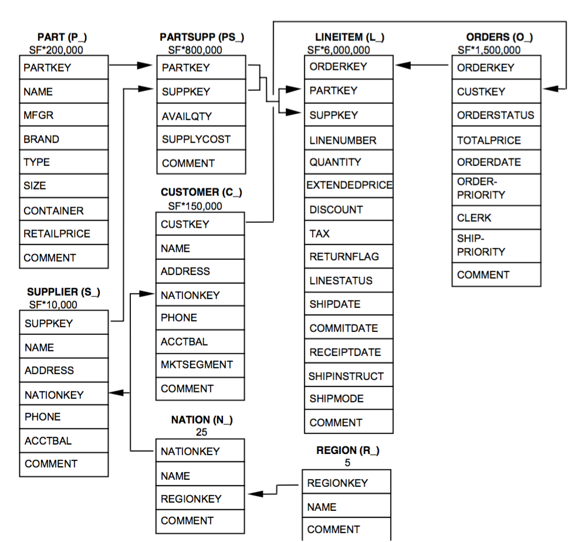

# Trabalho de sql

## Objetivo

O objetivo deste trabalho é se familiarizar com a linguagem SQL e serve como nota do trabalho T1. O trabalho deverá ser realizado com o SGBD SQLite3 que pode ser encontrado facilmente para instalacao em qualquer sistema operacional. Verifique se o seu computador ja possui o SGBD instalado digitando sqlite3 no terminal. A mensagem abaixo deve aparecer no seu terminal:

```sql
$ sqlite3
SQLite version 3.22.0 2018-01-22 18:45:57
Enter ".help" for usage hints.
Connected to a transient in-memory database.
Use ".open FILENAME" to reopen on a persistent database.
sqlite> 
```

## Carregando e verificando o BD

deve ser acessado no SQLite de acordo com o comando abaixo:

```sql
$sqlite3 tpch.db
```

Voce podera imprimir o esquema do BD com o commando abaixo:

```sql
sqlite> .tables
CUSTOMER  LINEITEM  NATION    ORDERS    PART      PARTSUPP  REGION    SUPPLIER
```

O BD do TPC-H possui o seguinte esquema relacional:


## Programando em SQL

Agora vamos programar em SQL e colocar os programas nos arquivos de entrega. Primeiro faremos um SQL teste pra verificar se a resposta bate com o esperado da avaliacao.

### Q1 Teste

```sql
sqlite> select distinct(r_name) from REGION;
AFRICA
AMERICA
ASIA
EUROPE
MIDDLE EAST
```

LEMBRETE: Voce deve colocar SOMENTE o comando SQL no arquivo "q1_test.sql" SEM os dados. Este arquivo devera ser colocado no subdiretorio com seu GRR (por ex., GRR000000). Nao esqueca que o ";" finaliza o comando SQL.

### Q2 Tipos de peças disponiveis

- Objetivo: liste os tipos distintos de peça dos produtos (tabela PART).

- Detalhe: mostre somente o tipo distinto de peça sem ordenar os dados.

- Arquivo: q2_tipo_pecas.sql

### Q3 Quantidade de clientes pelo segmento de mercado

- Objetivo: Conhecer o mercado da clientela (tabela CUSTOMER).

- Detalhe: mostre o segmento de mercado e conte o numero de clientes para cada segmento. Por ex. uma linha da resposta:

```sql
AUTOMOBILE|302
```

- Arquivo: q3_segmento_cliente.sql

### Q4 Liste o status das encomendas

- Objetivo: liste os tipos distintos de status das encomendas (tabela ORDERS).

- Detalhe: mostre somente o tipo distinto de status da encomenda sem ordenar os dados

- Arquivo: q4_tipo_encomendas.sql

### Q5 Liste os países que mais realizaram encomendas

- Objetivo: liste os países e a quantidade de encomendas de cada país.

- Detalhe: mostre o nome do país e sua quantidade de encomendas ordenada de forma decrescente pela quantidade.

- Arquivo: q5_qtd_encomendas.sql

### Q6 Liste a quantidade de itens encomendados pelos países (somente os TOP 10)

- Objetivo: liste os países e a quantidade de itens de cada país.

- Detalhe: mostre o nome do país e sua quantidade de itens encomendados ordenada de forma decrescente pela quantidade. Mostre somente os 10 países que mais possuem itens.

- Arquivo: q6_qtd_itens.sql

### Q7 Liste a quantidade de itens encomendados pelos países com mais de 62000 itens

- Objetivo: liste os países e a quantidade de itens de cada país.

- Detalhe: mostre o nome do país e sua quantidade de itens encomendados ordenada de forma decrescente pela quantidade. Mostre somente os países que possuem mais de 62.000 de itens encomendados.

- Arquivo: q7_qtd_itens_maior.sql

### Q8 Quantidade de clientes que nunca fizeram 'special request'

- Objetivo: contar os clientes que fizeram ordem de compra mas nunca fizeram 'special request': não podem ter o string 'special request' no comentário de compra O_COMMENT.

- Detalhe: mostre somente a quantidade dos clientes

- Arquivo: q8_not_special.sql

Q9 Quantidade de clientes que nunca fizeram ordem de compra:

- Objetivo: contar os clientes que nunca fizeram ordem de compra.

- Detalhe: mostre somente a quantidade dos clientes.

- Arquivo: q9_not_ordem.sql

### Q10 Quantidade de clientes que somente fizeram 'special request', mas sem pacote incomum

- Objetivo: contar os clientes que somente fizeram ordem de compra com O_COMMENT '%special request%' e nunca pediram O_COMMENT '%unusual package%'.

- Detalhe: mostre somente a quantidade dos clientes.

- Arquivo: q10_only_special_ordem.sql
