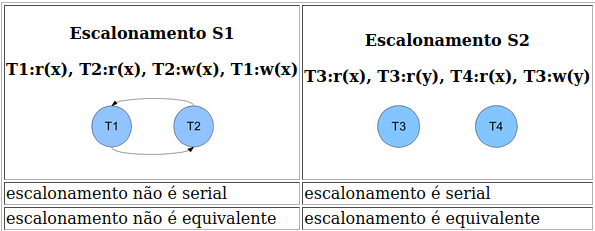
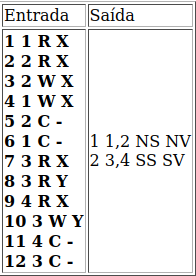

# Escalonamento de transações

2022-1

## Objetivo

Implementar dois algoritmos de detecção de conflitos de escalonamento de transações concorrentes. Estes algoritmos permitem o aluno compreender gargalos no processamento de transações.

## Algoritmo de teste de seriabilidade quanto ao conflito

* Crie um nó para cada T do escalonamento S
* Aresta Ti -> Tj para cada r(x) em Tj depois de w(x) em Ti
* Aresta Ti -> Tj para cada w(x) em Tj depois de r(x) em Ti
* Aresta Ti -> Tj para cada w(x) em Tj depois de w(x) em Ti
* S é serial se não existe ciclo no grafo

## Algoritmo de visão equivalente

Dois agendamentos S e S' são ditos visão equivalentes, se atenderem as seguintes condições:

* O mesmo conjunto de transações e operações participam em S e S'
* Para cada r(x) de Ti, se o valor de x lido ja foi escrito por w(x) de Tj, ou seja, houve W(x) antes de R(x) em transações distintas, o mesmo deve permanecer para r(x) de Ti em S'
* Se o operador w(y) em Tk é a ultima escrita de y em S, então w(y) em Tk deve ser a última escrita em S'

Por exemplo (mais exemplos serão vistos em sala):



### Entrada

A entrada deve ser feita pela entrada padrão (stdin). O arquivo é formado por uma sequência de linhas, onde cada linha representa uma transação chegando. Cada linha tem 4 campos: o primeiro é o tempo de chegada, o segundo é o identificador da transação, o terceiro é a operação (R=read, W=write, C=commit) e o quarto o atributo que será lido/escrito. Estas linhas estão ordenadas pelo primeiro campo (tempos menores no início indicando a linha do tempo).

### Saída

A saída deve ser feita pela saída padrão (stdout). O arquivo será composto por uma sequência de linhas. Uma linha para cada escalonamento. Cada linha tem 4 campos separados por espaço (um único espaço entre cada par de campos). O primeiro campo é o identificador do escalonamento. O segundo campo é a lista de transações. E o terceiro apresenta o resultado do algoritmo da garantia da seriabilidade, onde SS e NS significam respectivamente serial (SS) ou não serial (NS). O quarto campo é o resultado do algoritmo de teste de equivalência de visão, onde SV e NV significam respectivamente equivalente (SV) ou não equivalente (NV) .

Exemplo de arquivos com uma entrada e uma saída válida:



## Requisitos mínimos

O nome do executável deve ser escalona.

Não deve ter nenhuma opção de linha comando.

## O que deve ser entregue

Além dos arquivos fonte, deve acompanhar um makefile e um relatório com no máximo 2 páginas contendo a documentação sintetizada do sistema implementado. Qualquer particularidade deve estar descrita neste texto, como: algoritmo de detecção de ciclo em grafo.

Para compilar será usado o comando make (sem nenhum parâmetro), portanto preparem o Makefile para a compilação.

Para testar será executado um script como o abaixo.

```bash
./escalona < teste.in > teste.out
diff teste.sol teste.out
```

Onde teste.in é o arquivo de entrada do teste e teste.sol é o esperado como saída.
Caso o teste seja positivo (não imprime nada) será analisado o código fonte e o relatório.
Os fontes também devem ser comentados e a qualidade do codigo vale nota (e.g., Doxygen, Javadoc).

## Forma de entrega

O trabalho deve ser empacotado em um arquivo GRR1_GRR2.tar.gz, onde "GRR1" é uma string com a matricula de um dos alunos nas servidoras do DInf. Ao descompactar este arquivo deverá ser criado um diretório de nome "GRR1_GRR2" que conterá todos os demais arquivos. O make e o script acima deverão funcionar dentro deste diretório (não em subdiretórios). Por exemplo, a equipe com GRR2000 e GRR2001 enviará o arquivo GRR2000_GRR2001.tar.gz que deverá descompactar seus arquivos e subdiretorios no diretorio "GRR2000_GRR2001/"

O arquivo "...tar.gz" deve ser enviado por e-mail ao endereço do professor com o assunto "CI218-trab2 " (exatamente). IMPORTANTE: Minha caixa de email usa o assunto do email como filtro.
